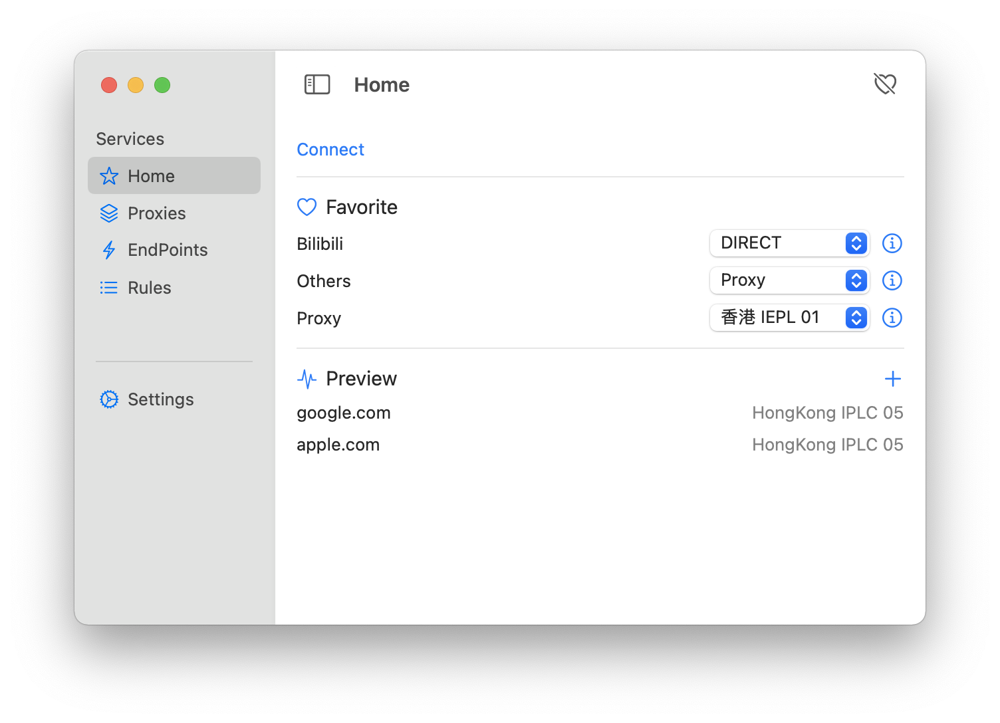

# ProxyFace

Another GUI App of [Clash](https://github.com/Dreamacro/clash) for macOS.

### Note

1. Only `trojan` and `shadowsocks(plain)` is supported
2. Default socks port is `8889` and http port is `8888`, and system proxy will be set when the app is launched.
3. Config(except the Picker of endpoint) will not apply until you tap `save and restart` button in setting tab.